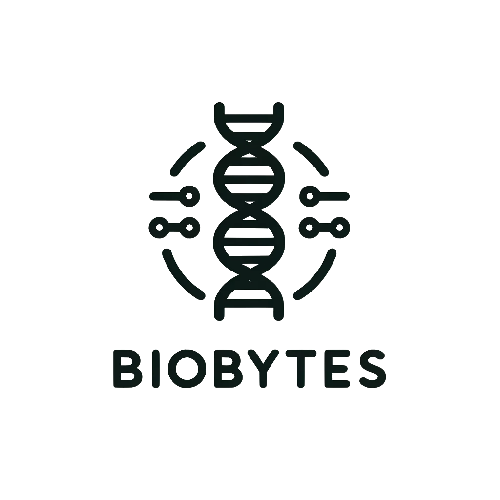

# TodayTest

  <a href="https://todaytest.org">
    
  <h3 align="center">오늘검사2.0</h3>
  </a>
  </a>
  

    AI와 진행한 증상문답으로 오늘 진행할 검사와 자신의 질병 미리보기 서비스
     
    <a href="https://todaytest.org"><strong>샘플 페이지 »</strong></a>

    BioBytes
  

## 개발정보
1) DB control : File-system
2) Framework : ![Flutter]
3) UserControl : :x:
4) Server : ![Ubuntu] ![Nginx]
5) API : ![OpenAI]

## 주요기능
1) 

[Gmail]: https://img.shields.io/badge/Gmail-EA4335?logo=gmail&logoColor=fff&style=flat
[Tistory]: https://img.shields.io/badge/Tistory-000?logo=tistory&logoColor=fff&style=flat
[Node.js]: https://img.shields.io/badge/Node.js-393?logo=nodedotjs&logoColor=fff&style=flat
[Express.js]: https://img.shields.io/badge/Express-000?logo=express&logoColor=fff&style=flat
[Passport.js]: https://img.shields.io/badge/Passport-34E27A?logo=passport&logoColor=000&style=flat
[React]: https://img.shields.io/badge/React-61DAFB?logo=react&logoColor=000&style=flat
[Next.js]: https://img.shields.io/badge/Next.js-000?logo=nextdotjs&logoColor=fff&style=flat
[NextAuth]: https://img.shields.io/badge/NextAuth-000000?style=flat&logo=nextdotjs&logoColor=white
[Ubuntu]: https://img.shields.io/badge/Ubuntu-E95420?logo=ubuntu&logoColor=fff&style=flat
[Nginx]: https://img.shields.io/badge/NGINX-009639?logo=nginx&logoColor=fff&style=flat
[Lets encrypt]: https://img.shields.io/badge/Let's%20Encrypt-003A70?logo=letsencrypt&logoColor=fff&style=flat
[CPP]: https://img.shields.io/badge/C%2B%2B-00599C?logo=cplusplus&logoColor=fff&style=flat
[Python]: https://img.shields.io/badge/python-3670A0?style=flat&logo=python&logoColor=ffdd54
[Tensorflow]: https://img.shields.io/badge/TensorFlow-%23FF6F00.svg?style=flat&logo=TensorFlow&logoColor=white
[OpenAI]: https://img.shields.io/badge/OpenAI-412991?logo=openai&logoColor=fff&style=flat
[Clang]: https://img.shields.io/badge/C-A8B9CC?logo=c&logoColor=fff&style=flat
[Coffee]: https://www.buymeacoffee.com/assets/img/custom_images/orange_img.png
[CodeForces]: https://badges.joonhyung.xyz/codeforces/oculis.svg
[Solved.ac]: http://mazassumnida.wtf/api/mini/generate_badge?boj=oculis
[Flutter]: https://img.shields.io/badge/Flutter-02569B?logo=flutter&logoColor=fff&style=flat